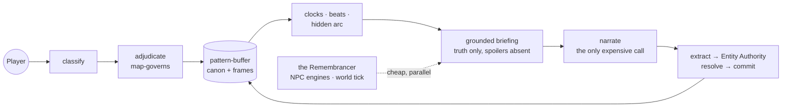

<div align="center">

# Construct Projector

**An interactive-fiction engine where the world's truth is a database and the model is only a voice.** *(“The Construct” for short.)*

Step into a book, or a world built from one conversation. Put something in a drawer, wander for an hour, come back — it's still there. The world remembers, so the model doesn't have to.

[](LICENSE)
[](https://www.python.org/downloads/)
[](#engineering-proof)
[](https://github.com/5000Stadia/pattern-buffer)
[](#project-status)

</div>

---

## Quick Start

```sh
curl -fsSL https://raw.githubusercontent.com/5000Stadia/construct/main/scripts/install.sh | sh
```

### Start playing

```sh
construct start                 # the same conversational entry your phone gets
```

You land at the projector's welcome — the world shelf, or describe a new world and it's shaped with you in conversation. Type what you do, line after line. (Each new scene gets an AI-painted image — the terminal can only print a path to it, so for the full experience with embedded scene imagery, **Telegram is the recommended way to play — and the easiest to set up** (two commands, below); Discord works too.) Every turn is saved; bare `construct play` resumes. Three complete worlds ship in the box — jump straight in with `construct play bodycase` (*The Rain in Bluegate Yard*, an original Victorian murder mystery).

### Make your own world

```sh
construct import path/to/your-story.md     # any .txt/.md becomes a playable world
construct new --interview "a drowned harbor town with a harbor-master's secret"
```

### Play from your phone (recommended — full scene imagery)

Telegram is the easiest: message [@BotFather](https://t.me/botfather) for a free bot token (takes a minute), then:

```sh
construct setup telegram        # one-time: paste the token
construct telegram              # the transport runs until you stop it
```

Keep it running after you close the terminal:

```sh
nohup construct telegram >> ~/.construct-telegram.log 2>&1 &
```

Discord works the same way ([docs/DISCORD.md](docs/DISCORD.md)). Both are outbound-only transports — no port, no tunnel — thin clients over the same session API:

```python
from construct import Session
s = Session.open("bodycase", player_id="me")
print(s.turn("I look around.").prose)
s.close()
```

Bring any LLM behind the provider interface. Re-running the install one-liner updates in place. Developers: `git clone` + `pip install -e .` works exactly as you'd expect (`construct turn bodycase "I look around." --debug` shows each turn's receipts — every write the turn committed, and why).

---

## The research question

Interactive fiction has always had to pick a failure. Hand-authored worlds are rich but rigid — every path pre-written. LLM-generated worlds are free but amnesiac — they contradict themselves within twenty turns, invent doors that were never there, and forget the spoon you set down. The failure isn't a model-quality problem; it's an **architecture** problem: the same context window is being asked to be the world's memory, its referee, and its voice.

The Construct is a working answer to: *what does long-form generative fiction look like when those jobs are separated?*

- **[pattern-buffer](https://github.com/5000Stadia/pattern-buffer)** holds the world's *truth* — an append-only assertion log with object permanence, per-character knowledge frames, event causality, and as-of queries. Nothing is forgotten; nothing is invented over canon.
- **The Construct** turns that truth into a *played experience* — a host that classifies the player's move, adjudicates it against the map, advances a hidden story arc, composes a grounded briefing, and only then lets a model narrate. The model never holds state; it renders it.

The name is the metaphor: like the Construct in *The Matrix*, it's the runtime that loads any stored world into a lived one. **pattern-buffer** holds the pattern → **the Construct** loads it into a played → **holonovel**.



---

## The design bet: structural absence over instruction

Every hard problem in this genre — spoilers, secret-leaking, railroading, contradiction — is conventionally attacked with prompt rules ("don't reveal the killer"). Rules erode under pressure. The Construct's recurring move is to make the failure **impossible to express** rather than forbidden:

- Characters can't leak secrets because the secrets were **never in their context window** — each NPC decides its beat from its own `knows:` frame, nothing more.
- The narrator can't spoil the arc because the hidden `plot:` frame is **never in its briefing**.
- The story can't puppet your character because your character is **never handed to it** as a scene entity.
- Prose can't mint phantom places because free-text extraction passes through pattern-buffer's single resolve seam, which **cannot type-slip** — bind to a known entity, mint once with the right kind, or drop; Entity Authority adds the channel permissions on top (who may mint what).

Where a rule would have been added, a doorway was narrowed instead. The design docs record each of these as a named decision with the live failure that forced it. These are claims about what is structurally absent from each context window, not perfection claims: an independent [fresh-eyes audit](docs/design/AUDIT-2026-07-FRESH-EYES.md) pressure-tested the seams and tracks the residual hazards it found — none currently misfiring, all latent — as named debt.

---

## Architectural contributions

The substrate (permanence, frames, time) is pattern-buffer's. What the Construct contributes is the layer nobody had: **the drama engine over a truth store.**

|  |  |
| --- | --- |
| **The hidden arc layer** | A story's destination authored into a private `plot:` frame the player never sees, navigated by beats, clocks, and a pacing ladder with anti-railroading guards. The arc pushes the world *at* you; it structurally cannot move *you*. |
| **Conclusion-as-effect** | No win/loss verdict is ever computed and announced. A story ends on its own decisive event ("IT"), and the ending's *character* — triumphant, costly, bittersweet, quietly failed — is derived from which of the story's load-bearing causes the player actually established. Turns never force a close: a detective can study one clue for three hundred turns. |
| **Entity Authority** | The channel-permission policy over pattern-buffer's resolve seam: every free-text canon write binds-before-minting against a canon roster, with channel-scoped mint permissions (player input cannot conjure people; prose cannot conjure places) and ambiguity never minting. The misshapen entity graph becomes impossible to create instead of cleaned up after. |
| **Build-seal fidelity repair** | Ingesting a book fragments a single character across ids or collides a person with a like-named place, and that fragmentation flickers cast in and out of presence at the render layer even while the substrate holds. A tiered, safest-first host pass over pattern-buffer's shipped identity surface repairs it at the build seal: auto-safe subsumption, then `reject` for cross-kind homonyms (the person when addressed, the place when travelled to), then verified type-slip absorption, then a **vouched merge** that folds a true same-name split into the arc's canonical id — but *only* when the collision touches the protagonist or a required-clue holder, so the story can vouch it is one character. The engine stays arc-blind; severity is host truth. |
| **World laws** | Every generated world is authored ON a constitution: 1–4 named, universe-governing dynamics (rule · cost · embodiment · texture), register-gated so a courtroom drama can never draw "the Force," anti-pastiche-judged, committed as queryable canon with embodiment links. Laws the character inherently understands ground the opening; *discovered* laws bind silently until play uncovers them. |
| **First-mention permanence** | A proper-named detail the world establishes ("The Hart and Bell") commits immediately as a minimal, non-present stub — engagement paints the rest. The gate's evidence is real casing recovered from prose, fail-closed; generic descriptions ("the street") still never mint. |
| **The Remembrancer** | The protagonist's own memory as a silent turn participant, symmetric with NPC engines: a screened knowledge-frame digest, contributing only felt interiority. It owns self-questions mechanically, and it powers **player-authored retconning** — "I remember my childhood friend John Johnson" commits real autobiography through a guarded channel where world-claims become beliefs that can never satisfy the mystery, and contradictions quarantine in favor of the first established truth. |
| **Knowledge frames as gameplay** | Interviewing a witness is mechanically real: authored clues sit in *their* frame (pattern-buffer's `knows:` frames), gated by Construct's reveal conditions, and surface into *yours* only when your questioning earns them — which is what advances the case. A diegetic notebook renders your frame back to you as the case-board. |
| **Deterministic resolution deck** | Uncertain actions draw from a pre-rolled, seeded 100-tier outcome bag (fail-forward: every failure opens something) — drama without a per-check model call and fully replayable. |
| **Death as staged permanence** | A per-chapter `death_policy` decides whether death ends the story (action/adventure), is transformed by the premise (time loops, ghosts), or is capped by genre convention (cozy mystery → wounds, capture, ruin). Mortal peril must be *staged* — the world warns before it kills — and a death ends in a testament epilogue: the world after you, and your effect on it. No respawn, no next chapter. |
| **Episodic continuation with settled history** | A concluded story offers the next chapter over the same evolved world: consequences of your ending ride forward as canon events with causal receipts, answered questions become closed history that is *never re-opened as mystery*, and personal promises are extracted as first-class fuel the next chapter must honor or consciously pay off. |
| **Diegetic time as the only clock** | Turns are free; only in-world time can pressure a story, and only when a deadline genuinely belongs to it (the bomb, the King's dinner). Numeric stakes (oxygen, fuel) are gauges folded from signed per-turn deltas — surfaced as mounting pressure, never a HUD. |
| **A living world** | Off-screen characters move on their own schedule (committed through the same gated doorway, discovered rather than narrated), companions interject unprompted, and presence *holds* — a character who is here stays engageable rather than evaporating between turns. |
| **The regenerative arc engine** | The answer to "the case is solved — then what?": a portfolio of arcs, not one. Side stories live and die on their own lifecycle; a failed arc **acknowledges its death diegetically and emits fallout as true canon consequence** — fuel, not error. A paced, fail-open DM then mints fresh side arcs through the same hidden-arc grammar from three triggers: a dead thread's fallout, the player's own committed changes (a deterministic salience read decides when the DM even wakes — it notices, it never polls), and genuine in-world quiet (measured on the story clock, never turn count — thirty turns of contemplation summon nothing). Guarded against quest-soup by caps, cooldowns, situation fingerprints, depth limits, a mint-time coherence preflight, and dramatic right-of-way: nothing generates while the main story is at its peak. |

---

## Evaluation methodology

The claim of a system like this can't be proven by unit tests alone — the product is a *felt experience over hundreds of turns*. The project's evaluation stack, all in-repo and reproducible:

- **A structured live-eval suite** — 5 scenarios × 18-turn schedules (follow-the-thread / push-the-edges / draw-on-character-knowledge / conclude) driven by an LLM player, with per-scenario assessments and a consolidated engineering report: [`docs/design/eval/`](docs/design/eval/00-CONSOLIDATED-REPORT.md).
- **An adversarial critic campaign** — player-agents *primed to break immersion and file their own bug reports* through the in-game `/feedback` channel, including deliberate off-path runs (pursuing a romance the story never offered) and cross-chapter continuations. Every filing was independently triaged against engine ground truth before anything was "fixed": [`eval/09-critic-campaign.md`](docs/design/eval/09-critic-campaign.md).
- **A five-probe live acceptance set** — object permanence, loop closure, frame non-leak, player agency, honest adjudication — passed 5/5 in live play and re-verified as the engine grew.
- **A generalized synthesis** — the campaign's findings distilled into five portable pillars of the optimal interactive-fiction experience (truth-keeping, the player's story is the story, proportion, initiative, the ending is the payoff): [`docs/design/OPTIMAL-IF-EXPERIENCE.md`](docs/design/OPTIMAL-IF-EXPERIENCE.md).
- **1100+ test functions across 38 files** — including structural pins for every invariant the design docs promise (frame non-leak, protected-key concealment, mint-channel discipline, terminal precedence, no-reopen of settled history).

### Development methodology

The engine was built through a **multi-agent adversarial review loop**: every substantive design goes to an independent reviewer model as a written spec letter before implementation, and every build goes back as a diffable report reviewed against the real worktree — with explicit BLOCKED / YELLOW / GREEN verdicts. The full correspondence (440+ numbered letters) is the project's decision record; blockers the reviewer caught on this codebase include a frame-privacy leak in a resolver roster, a policy gate that mis-fired on first contact, and an event-causality write that silently landed on the wrong row. Nothing ships on self-review.

---

## Proven in live play

The shipped example, ***The Rain in Bluegate Yard*** — a complete original Victorian murder mystery (London, 1888; a dock messenger dead in Bluegate Yard; a plain-clothes bureau racing the Met) — plays end-to-end on a real model: grounded cold open, earned clue trail, companion texture, a staged conclusion scene, a consequence-bearing epilogue, and a next chapter grown from the wake of the first. Two further worlds (a dark-fantasy pilgrimage, an undersea survival thriller) exercise the other genre shapes.

Worlds are built, not hand-coded: drop any prose document in and it becomes a playable world, or build one live from a one-line brief through the session-zero interview.

---

## Documents

The project is **design-first**: 60 design documents, each recording a decision, the live failure that motivated it, and the review verdict it shipped under.

- **[docs/CONCEPT.md](docs/CONCEPT.md)** — the founding brief: vision, host architecture, the arc layer.
- **[docs/design/00-INDEX.md](docs/design/00-INDEX.md)** — the curated map of all design docs, by layer.
- **[docs/design/OPTIMAL-IF-EXPERIENCE.md](docs/design/OPTIMAL-IF-EXPERIENCE.md)** — the research synthesis: five pillars of the optimal interactive-fiction experience, grounded in the evaluation corpus.
- **[docs/design/eval/](docs/design/eval/00-CONSOLIDATED-REPORT.md)** — the evaluation suite: consolidated report, per-scenario assessments, the critic campaign.
- **[docs/LEXICON.md](docs/LEXICON.md)** — the working vocabulary.

**For technical reviewers:** this README → [ARC-LAYER](docs/design/ARC-LAYER.md) → [CONCLUSION-AND-OUTCOME](docs/design/CONCLUSION-AND-OUTCOME.md) → [ENTITY-AUTHORITY](docs/design/ENTITY-AUTHORITY.md) → [OPTIMAL-IF-EXPERIENCE](docs/design/OPTIMAL-IF-EXPERIENCE.md) → the [eval suite](docs/design/eval/00-CONSOLIDATED-REPORT.md).

---

## Engineering proof

- **1100+ test functions, 38 files, zero live model calls in the suite** — engine extraction via pattern-buffer's `StubModel`, host cohorts via a canned provider; the full suite runs in under two minutes.
- **Deterministic spine, model calls only at the boundaries.** Classification, adjudication, arc evaluation, entity resolution, and all bookkeeping are deterministic or cheap-tier; the expensive model renders prose and voices characters, nothing else. Turn latency is protected by a deferred-settle design: post-narration bookkeeping overlaps the player reading.
- **Fail-open discipline everywhere it must be.** No enrichment call may sink a turn; the climax cannot be lost to a provider hiccup; every dropped cohort is receipted in the turn trace.
- **Receipts-first debugging.** Every turn emits a structured trace — writes, resolver decisions with reasons, clocks fired, clues surfaced, cohort calls — the same record the debug CLI, the tests, and the eval reports all read.
- **Honest failure records.** The eval reports and design docs record what broke and what it cost, by name, next to what shipped — including a full fresh-eyes architecture audit ([AUDIT-2026-07-FRESH-EYES](docs/design/AUDIT-2026-07-FRESH-EYES.md)).

---

## Capability status

| Surface | Status | Notes |
| --- | --- | --- |
| Turn loop (classify → adjudicate → arc → narrate → commit) | Live | Deterministic spine; model at the boundaries only |
| World ingestion (document → playable world) | Live | Build narrated in plain stages; identity-coherence gate at build |
| Session-zero interview + character creation (the Foyer) | Live | Play-as-anyone; name/pronouns/background authoritative over authored defaults |
| Hidden arc: beats, clocks, pacing, convergence | Live | Anti-railroading guards; refusal handled diegetically |
| Interview/examine clue delivery + case-board notebook | Live | Topic-aware; earned-only; the notebook is the player's own frame |
| Conclusion-as-effect + epilogue + episodic continuation | Live | Settled history never re-opens; consequences carry causal receipts |
| Death & the testament (per-chapter policy) | Live | Staged peril; premise-transformed death for loop/ghost shapes |
| The Remembrancer + player-authored memory (retcon) | Live | Contradictions quarantine; world-claims become beliefs |
| Entity Authority + first-mention permanence | Live | Channel-scoped minting; prose-casing evidence, fail-closed |
| Build-seal fidelity repair (coreference / typing) | Live | Tiered safest-first pass; arc-vouched merge only for load-bearing ids; fail-open |
| Shape-aware place granularity | Live | Intimate/domestic shapes ground the interior at room scale; the opening anchors to the most specific place, not the enclosing city |
| Living-World Generator (multi-arc portfolio + the opportunistic DM) | Live | Arc lifecycle with fallout-as-canon; regenerative/opportunistic/ambient triggers; one mint per turn behind six guards + dramatic right-of-way |
| Gauges, diegetic time, world-tick, companions | Live | — |
| World laws (authored constitution, register-gated, disclosure axis) | Live | The narrator briefs it every turn on a reserved lane; adjudication enforces it |
| Scene imagery (per-location AI illustration) | Live | Oil-painting style; regenerates only when the scene truly changes |
| Telegram / Discord / CLI / REPL transports | Live | One session API; outbound-only, no inbound exposure |
| Multi-player shared worlds | Designed, not built | [Design notes](docs/design/) — shared-world observer semantics to be worked jointly with the substrate |
| `run_turn` decomposition | Known debt | The turn spine is one ~4,000-line function (`turnloop.py`) — deliberately unsplit while the turn contract is still moving; carried in the open here rather than silently |
| Narrator-authored NPC movement (the CAST-MOVES lane) | Live | Narrated arrivals/departures become canon presence truth through five stagecraft rules (never the player, never a bound companion, no minted places, scene-touching only, engaged cast can't vanish mid-conversation); receipt-confirmed commits; fail-closed against ambiguous prose — live-accepted |
| Journey-price anchoring (route precedent) | Live | The first pricing of a route is its canon precedent — the same road costs the same time in both directions, forever; receipt-confirmed durability with a settle backstop |
| Drift handling — the complete program (D1 relocate + D2 absence-consequence + D3 alternative-path repair) | Live | Dodge the staged clue-holder and the mechanic finds you; skip the deadline and the window closes without you — the lapse becomes canon and a durable callback surfaces as felt consequence; and when the world kills a route outright, the HOST re-mints the beat's own mechanic through a LIVE surviving carrier (walkability + witness-driving-entity + shared action-eligibility gates; graph-derived repair budget) with the new road rendered diegetically — where no honest road exists the repair declines and the refusal clock concludes the story incompletable, never a zombie |

---

## Family

Three projects, one line of research — each a résumé of the last:

- **[pattern-buffer](https://github.com/5000Stadia/pattern-buffer)** — the append-only world-state engine: current state, knowledge frames, and history as derived projections over one assertion log. The Construct is its first full-depth adopter.
- **[Kernos](https://github.com/5000Stadia/Kernos)** — a personal-agent kernel (v1.0, research complete). The Construct inherits its cohort architecture — bounded specialist workers around one principal voice — and its house methodology: design-first, spec-reviewed, receipts-first.
- **The Construct** (this repo) — the drama engine: what a *story* is, mechanically, when the world underneath it is guaranteed to hold.

## Project status

**Pre-1.0, research active.** The engine plays end-to-end on a real model; the current suite is green (1100+ tests); the evaluation corpus and design record are current through July 2026. The remaining named gaps are documented as future work in the [synthesis](docs/design/OPTIMAL-IF-EXPERIENCE.md) and the [capability table](#capability-status), not left implied.

## License

MIT — see [LICENSE](LICENSE). Built by [@5000Stadia](https://github.com/5000Stadia).

---

*The model narrates. The world remembers, refuses, and keeps its own truth.*
